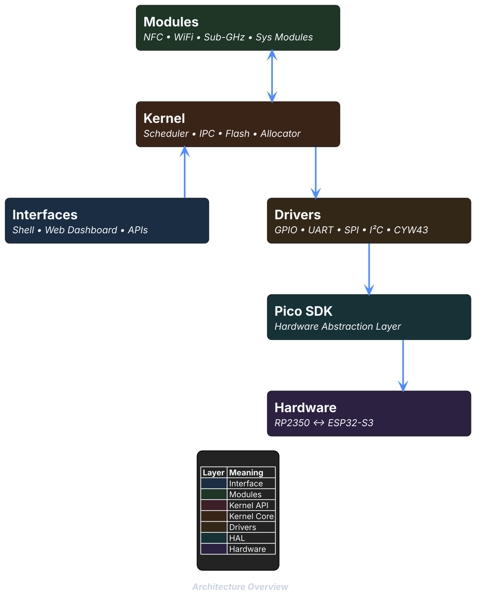
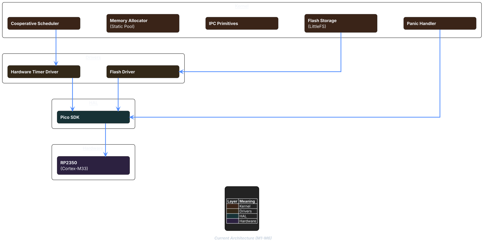

# PicoKernel

> A bare-metal OS for the Raspberry Pi Pico 2W (RP2350-ARM) built from scratch, no RTOS.


[](https://discord.gg/Ucb9xt8B6r)

---

## What is PicoKernel?

PicoKernel is a custom operating system kernel written in C for the **Raspberry Pi Pico 2W (RP2350, Cortex-M33, 520 KB SRAM)**. It targets resource-constrained embedded hardware with no MMU and no RTOS dependency. The Pico SDK is used strictly as a hardware abstraction layer all scheduling, memory management and IPC are implemented from scratch unless stated otherwise.

The project is developed as a learning-focused embedded OS, with a companion security research device application as a primary real-world target.

---

## Hardware

| Role | Board | Responsibility |
|------|-------|----------------|
| Primary | Raspberry Pi Pico 2W (RP2350) | OS, UI, BadUSB/HID, IR, storage |
| Peer coordinator | ESP32-S3 | NFC, sub-GHz, BLE, heavy Wi-Fi operations |

The two boards communicate over **UART IPC** no master/slave relationship, both are peers.

**Peripheral modules (current and planned):**

- `PN532` - NFC read/write
- `CC1101 / HC-11` - 433 MHz sub-GHz RF
- `2.23" OLED 128×32` - CH1116 driver, primary UI display
- Additional RF and sensor modules planned for future hardware revisions

---

## Architecture at a glance

PicoKernel enforces a strict layering policy as shown below:



**Layer responsibilities:**

- **Modules** - High-level feature subsystems. Depend only on the kernel API.
- **Interface** - User-facing control layer, allowing user to interact with the OS. Depend only on the kernel API.
- **Kernel** - Core OS primitives: memory allocator, cooperative scheduler, IPC, flash storage, panic handler.
- **Drivers** - Thin hardware drivers. No business logic. Call Pico SDK only.
- **Pico SDK** - Used as a HAL. Not extended, not bypassed.
- **Hardware** - Physical silicon and connected peripherals.

## Current Architecture



| # | [Milestone](https://codeberg.org/PicoKernel/PicoKernel/milestones) | Status |
|---|-----------|--------|
| M1 | Toolchain / serial output | ✅ Complete |
| M2 | Panic handler | ✅ Complete |
| M3 | Memory allocator | ✅ Complete |
| M4 | Cooperative round-robin scheduler | ✅ Complete    |
| M5 | IPC | ✅ Complete  |
| M6 | Flash storage (LittleFS) | ✅ Complete  |
| M7 | Wi-Fi scan | ✅ Complete  |
| M8 | Raw packet capture | ✅ Complete  |
| M9 | Serial shell | 🔄 In progress |

For roadmap and future architecture, see the [Developer Docs](https://picokernel.codeberg.page/PicoDocs/arch_overview.html)

---

## Documentation

| Type | Audience | Location |
|---|---|---|
| README | Everyone | You're reading it |
| User wiki | Hardware users, hobbyists | [Codeberg Wiki](https://codeberg.org/PicoKernel/PicoKernel/wiki) |
| Developer docs | Contributors, developers | [Codeberg Pages](https://picokernel.codeberg.page/PicoDocs/) |

The **user wiki** covers flashing, hardware wiring, module usage, and troubleshooting.(User wiki is not yet available, Coming Soon...)

The **developer docs** are Doxygen-generated and cover architecture internals, API
references, subsystem design decisions, versioning policy, and the contribution
workflow. They are regenerated automatically on every push to `main`.

---

## Contributing

Contributions are welcome. Before opening a PR, please read
[CONTRIBUTING.md](CONTRIBUTING.md) it covers branch naming, commit format,
documentation requirements (Doxygen template), and the PR review process.
All PRs must pass build and lint checks before review.

> **Note:** The project is pre-v1, the branch structure is different from what's explained here and under active development. APIs and internal
> interfaces change frequently. If you'd like to contribute, check the
> [open issues](https://codeberg.org/PicoKernel/PicoKernel/issues) for good
> first tasks and please ask the issue be assigned to you before working on it or reach out via a Codeberg issue before starting work.

---

## Versioning

PicoKernel uses a structured versioning scheme defined in `include/version.h`.

**Format:** `MAJOR.MINOR.PATCH-stage.N`

| Segment | Meaning |
|---------|---------|
| `MAJOR` | Increments when a full milestone cycle is complete and stable |
| `MINOR` | Increments per 2 milestones completed |
| `PATCH` | Bugfixes, small improvements, documentation-only changes |
| `-stage` | `alpha` = core subsystems still missing; `beta` = all subsystems present, testing; `rc.N` = release candidate; `stable` = stable release for production |
| `.N` | Fix iteration within a stage |

**Examples:**

| Version | Meaning |
|---------|---------|
| `0.1.0-alpha` | M1 + M2 done, actively building |
| `0.2.0-alpha` | M3 + M4 done |
| `0.3.0-alpha` | M5 + M6 done |
| `0.4.0-beta` | M7 + M8 done, stabilising |
| `0.5.0-beta` | M9 done |
| `0.5.0-rc.1` | Hardening for v1 |
| `1.0.0-stable` | First stable release |
| `1.0.1-stable` | Critical hotfix to stable |

The single source of truth for the current version is `include/version.h`

---

## Getting Started

There are two ways to get started with using PicoKernel on your own hardware :

### Download one of our official releases

You can grab a one of our releases from our release page and jump straight to [Flashing](#flash)!

Unfortunately at the time of writing this README, we don't have any releases :(
v1.0.0 will be first stable release, Coming Soon...

### Build from source

Checkout the below section if you want to build the latest version from source.

#### Prerequisites

- A Raspberry-pi Pico 2W (atleast)
- `arm-none-eabi-gcc` toolchain installed and on `PATH`
- This section assumes you're on Linux
- `cmake` ≥ 3.13
- `ninja` or `make`
- Pico SDK submodule initialised (see below)
- `picotool` or `openocd` for flashing (optional)

#### Clone and initialise submodules

```bash
git clone https://codeberg.org/PicoKernel/PicoKernel.git
cd PicoKernel
git submodule update --init --recursive
```

#### Build

```bash
mkdir build && cd build
cmake .. -DPICO_BOARD=pico2_w
cmake --build . -j$(nproc)
```

The build produces `picokernel.uf2` and `picokernel.elf` in `build/`.

#### Flash

**UF2 (drag-and-drop):**

```bash
# Hold BOOTSEL while connecting USB, Raspberry-pi Pico will appear as a storage device, release BOOTSEL.
cp build/picokernel.uf2 /run/media/$USER/RPI-RP2/ # OR WHATEVER THE PATH TO RASPBERRY-PI IS.

#NOTE : If you downloaded one of our releases, you must have got a .uf2, you can copy that .uf2 to the Raspberry-pi and it will reboot automatically
```

**OpenOCD (SWD):**

```bash
openocd -f interface/cmsis-dap.cfg -f target/rp2350.cfg \
  -c "program build/picokernel.elf verify reset exit"
```

#### Serial output

```bash
# Replace /dev/ttyACM0 with your device, you can use minicom/picocom both.
minicom -b 115200 -D /dev/ttyACM0
```

---

## Future Plans

### Post-v1 branch restructure

After the `1.0.0` release, the repository will migrate to a structured branching model:

```
main          ← stable only, protected, PRs only
dev           ← all active work, parent: main
feat/k/*      ← kernel features
feat/d/*      ← driver features
feat/m/*      ← module features
bugfix/k/*    ← kernel bugfixes
hotfix/*      ← off main, merged back to main + dev
```

NOTE: Refer to the [developer docs](https://picokernel.codeberg.page/PicoDocs/git_workflow.html) for the full branch naming convention and subsystem initials reference.

### Hardware expansion

Future revisions plan support for additional hardware targets beyond the Pico 2W, with the architecture designed to accommodate new drivers and modules without modifying the kernel core.

---

## License

| Component | License |
|---|---|
| Source code (`src/`, `include/`, `scripts/`) | `GPL-3.0-or-later` |
| Documentation (`docs/`, `README.md`, `CONTRIBUTING.md`) | `CC-BY-SA-4.0` |
| Logos and branding (`docs/assets/logos/`) | All Rights Reserved |

**What GPL-3.0-or-later means:**

- You are free to use, study, modify, and distribute this software.
- Any distributed modifications must also be released under `GPL-3.0-or-later` with source available.
- You cannot incorporate this code into a proprietary closed-source product without complying with GPL terms.

**What All Rights Reserved means for logos:**

- Project logos and branding assets may not be reproduced, distributed, or used
  without explicit written permission from the copyright holders.
- To request permission, contact <picokernel@modprobe.dev> or open an issue on [Codeberg](https://codeberg.org/PicoKernel/PicoKernel/issues).

See [`LICENSES/GPL-3.0-or-later`](LICENSES/GPL-3.0-or-later.txt) for the full source license.
See [`LICENSES/CC-BY-SA-4.0`](LICENSES/CC-BY-SA-4.0.txt) for the full documentation license.
See [`LICENSES/LicenseRef-PicoKernel-Branding`](LICENSES/LicenseRef-PicoKernel-Branding.txt) for the full copyright.
For full GPL rights and obligations, refer to the [GNU GPL FAQ](https://www.gnu.org/licenses/gpl-faq.html).
